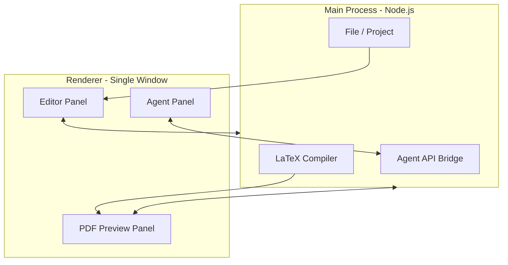

# IntelliTex: Implementation Approach

This document describes the implementation approach: high-level architecture, the three panels and their tech stack, and the agentic workflow.

---

## High-level architecture (Electron app)

IntelliTex is a single-window Electron app. The **main process** (Node.js) owns the LaTeX toolchain, file system, and agent API; the **renderer** (one browser window) hosts the React UI. They communicate via **IPC** (preload exposes a small API to the renderer).

- **Main process**: Creates the window, runs `latexmk`/`pdflatex` (via `child_process`), reads/writes project files, and calls the LLM API (or local model). Exposes IPC handlers for: open/save file, compile, send agent prompt, apply edit.
- **Renderer**: One React app with three resizable panels. Uses `window.electronAPI` (from preload) to request compiles, file operations, and agent actions; receives results and updates the UI (Monaco diagnostics, PDF blob, chat messages).

Data flow in short: user edits in the left panel → compile requested via IPC → main runs LaTeX → main sends errors + PDF path (or blob) back → renderer shows diagnostics and PDF. User asks the agent → renderer sends prompt + context via IPC → main calls LLM → main streams response back → renderer shows reply; on "Apply" the renderer applies the suggested edit in Monaco.

---

## The three panels: what they are made with

| Panel | Purpose | Technology | Features (target) |
|-------|---------|------------|--------------------|
| **Left – Editor** | LaTeX source editing | **Monaco Editor** (same core as VS Code) | LaTeX syntax highlighting, line numbers, tabs or file tree for multi-file projects. Diagnostics from parsed LaTeX log (red squiggles). Inline diff suggestions from the agent with Accept/Discard. |
| **Center – PDF** | Compiled paper preview | **pdf.js** (Mozilla) in a dedicated view or iframe | Renders the PDF produced by `latexmk`/`pdflatex`. Zoom, page navigation (e.g. 1/12, prev/next). Optional later: SyncTeX (click in PDF to jump to source line). |
| **Right – Agent** | AI assistant | **React** (chat UI) + **IPC** to main for LLM | Chat message list + input ("Ask Copilot anything…"). Suggested actions: "Fix errors", "Explain code", "Summarize" (predefined prompts + current file/selection). Display suggestions with reasoning; "Apply" sends the edit to the editor. Model indicator and settings (API key, endpoint). |

- **Editor panel**: Monaco instance in `EditorPanel.tsx`; language set to LaTeX (syntax + basic completions). Diagnostics come from the main process (parsed log) via IPC.
- **PDF panel**: pdf.js loads the PDF from a path or blob URL provided by the main process after a successful compile.
- **Agent panel**: Pure React for layout and state; all LLM calls go through the main process (no API keys in renderer). Streamed responses are pushed to the UI via IPC or a similar channel.

---

## Agentic workflow

The agent does **not** discover where to edit by itself. The app **injects explicit context** into every request; the model returns **what** to change; the **client** applies the change in the editor.

### Context you send ("where" the agent operates)

| Context | Purpose |
|--------|--------|
| **Current file** | Full path + full text (or selection) of the active editor buffer. |
| **Cursor / selection** | Line and column (or range) so the model knows the focus (e.g. "fix the error here"). |
| **Compile errors** | Parsed LaTeX log: `file:line:message`. Included in the system or user message so the agent can say e.g. "line 9: use `\LaTeX` not `\latexx`". |
| **Optional: other files** | e.g. `main.tex`, `Chapters/Introduction.tex`—when the user @-mentions them or the task needs it. |

Example: system message = "You are a LaTeX assistant. Current file: `Chapters/Introduction.tex`. Compile errors: …"; user message = "Fix the error on line 9" (or the user’s exact words). The model sees file path, content, errors, and selection, and can refer to "line 9"; it does not need to return coordinates if you pass the full content—you derive the edit from the model’s suggested text.

### How edits are applied (client-side)

1. **Model output**: Either (a) natural language + a code block with the fixed snippet, or (b) structured output (e.g. JSON: `{ file, range, newText }`). (a) is simpler to ship; you parse the code block or old/new snippet from the message. (b) gives reliable, unambiguous edits.
2. **Your app**: In the renderer, call Monaco’s edit API: `editor.executeEdits('agent', [{ range, text }])`, where `range` is derived from the current file and the model’s "line 9" or by matching the old string in the buffer.
3. **Single-file flow**: For "fix this file," you send one file’s content; the model returns the corrected snippet or a small diff; you find the corresponding range in the current buffer and apply one or more edits. No RAG is required for this.

Summary: **Where to edit** = what you put in the prompt (file path, content, selection, errors). **What to edit** = what the model returns. **Applying** = your code mapping that to Monaco ranges and calling `executeEdits`.

### RAG (optional, later)

For "fix this" / "explain this" / "suggest here," **direct context is enough**: current file + selection + compile errors. **RAG** (chunk → embed → retrieve on query) becomes useful when the user asks things like "Where do we cite Smith?" or "Summarize the whole thesis" and the project is too large to fit in one context window. Recommendation: ship v1 without RAG; add a simple RAG pipeline later (chunk `.tex`/`.bib`, embed, vector store, retrieve top-k and append to prompt) when you need project-wide search or summarization.

---

## Implementation phases

1. **Phase 1 – Shell and layout**  
   Electron + React (Vite), single window, three resizable panels (e.g. `react-resizable-panels`). Basic menu (File: New/Open/Save, View: Toggle panels) optional.

2. **Phase 2 – Editor and files**  
   Embed Monaco; LaTeX language support (syntax + completions). Main process: open/save file(s), optional project folder. Show open file(s) in the left panel; persist last opened file/folder.

3. **Phase 3 – Compile and PDF**  
   Main process: spawn `latexmk` (or `pdflatex`) on the project root or main file. Parse log for errors; send to renderer for Monaco diagnostics. On success, load the output PDF in the center panel (path or blob URL).

4. **Phase 4 – Agent**  
   Define an agent API in the main process (send prompt + context; optionally stream response). Chat UI and suggested actions; context = current file, selection, last compile errors. Connect to LLM API (or local model); "Apply" converts agent output to a Monaco edit and applies it in the renderer.

5. **Phase 5 – Polish**  
   Inline suggestions in the editor (diff + Accept/Discard). Optional: SyncTeX, settings screen (API keys, compiler path, theme), packaging with `electron-builder`.

---

## Key files (reference)

| File / folder | Role |
|---------------|------|
| `electron/main.js` | Window create, IPC handlers (file, compile, agent), menu. |
| `electron/preload.js` | Exposes `window.electronAPI` for safe IPC from renderer. |
| `electron/compile.js` | LaTeX invoke + log parsing (used from main process). |
| `src/App.tsx` | Three-panel layout and top-level state. |
| `src/panels/EditorPanel.tsx` | Monaco wrapper, language, diagnostics. |
| `src/panels/PDFPanel.tsx` | PDF viewer (pdf.js). |
| `src/panels/AgentPanel.tsx` | Chat, suggested actions, "Apply" to editor. |
| `src/agent/` | Agent API client and "apply edit" logic (types, IPC calls). |
