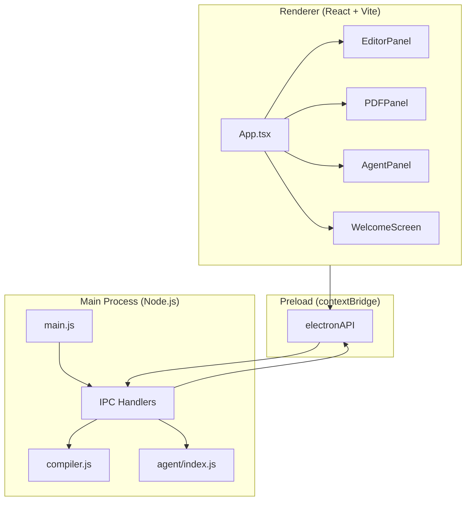
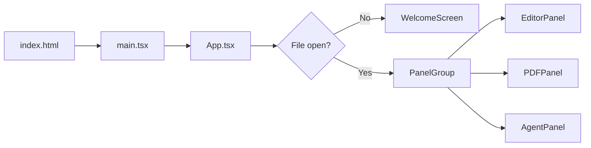
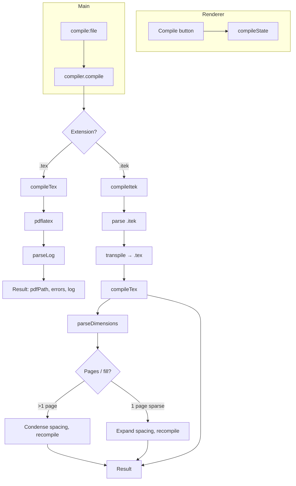
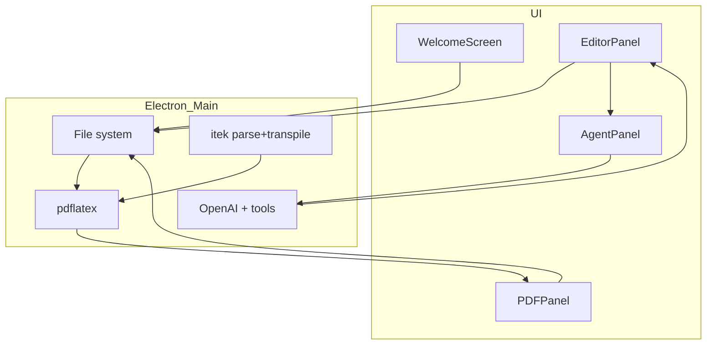

# IntelliTex — How the Project Works

IntelliTex is a **desktop LaTeX IDE with an AI assistant**, built as an Electron app. It supports both raw **LaTeX** (`.tex`) and a custom **itek** resume language (`.itek`) that transpiles to LaTeX. This document explains the architecture, data flow, and how each part fits together.

---

## 1. High-level architecture

The app has two main layers: the **Electron main process** (Node.js, file system, menus, IPC, compiler, AI agent) and the **renderer** (React + Vite, UI and panels). They communicate only via **IPC** through a preload bridge.



---

## 2. Process and window flow

- **Electron main** (`electron/main.js`): creates the window, application menu (File / Edit), and registers all IPC handlers. In dev it loads `http://localhost:5173` (Vite); in production it loads `dist/index.html`.
- **Preload** (`electron/preload.js`): exposes a safe `window.electronAPI` with no Node integration in the renderer. All file, compile, PDF, and agent operations go through this API.
- **React entry**: `src/main.tsx` mounts `App` into `#root`; `App.tsx` holds global state (open file, compile status, panel order, theme, chat attachment, pending diff) and decides between the **Welcome screen** and the **three-panel workspace**.



---

## 3. Three-panel workspace

When a file is open, the UI is a **resizable three-panel layout** (using `react-resizable-panels`):

| Panel | Role |
|-------|------|
| **EditorPanel** | Monaco editor for `.tex` / `.itek`. Rename file, save, “Add to Chat” (selection). Shows a **diff view** when the agent proposes edits (Accept / Discard). |
| **PDFPanel** | Renders the compiled PDF with **pdf.js**. Shows compile status, errors/warnings list, zoom, page indicator. Gets PDF path from compile result; reads bytes via `electronAPI.readPDF(pdfPath)`. |
| **AgentPanel** | Chat UI: user prompt + optional **attachment** (editor selection). Sends context + history to main via `agent:process`; receives streaming text and “thinking” status via `agent:progress`. Can apply agent **edits** as a pending diff. |

Panels can be **reordered** (move left/right), **hidden** (toggle in header), and **resized** by dragging. App state holds `panelOrder` and `hiddenPanels` and derives `visiblePanels`.

---

## 4. File and compile flow

- **Open / New / Recents**: Handled in main (dialogs, `fs`). Main returns `{ filePath, content }`; App sets `openFile` and `contentRef.current`.
- **Save**: Renderer calls `electronAPI.saveFile(filePath, content)` (current content from `contentRef`).
- **Compile**: User clicks Compile (or ⌘B). App saves, then calls `electronAPI.compileFile(filePath)`. Main uses `electron/compiler.js`.



- **`.tex`**: `compileTex()` runs `pdflatex` in the file’s directory, parses the log for errors/warnings, cleans aux files, returns `{ success, pdfPath, errors, log }`.
- **`.itek`**: `compileItek()` parses the `.itek` file (itek parser), **transpiles** to LaTeX (itek transpiler), writes a temporary `.tex`, then runs the same `pdflatex` pipeline. It also does **dynamic spacing**: measurement pass, then condense (if multi-page) or expand (if single page with lots of whitespace) and recompile until the layout fits.

Compile result is stored in App as `compileState` (`idle` | `compiling` | `done` with `result`). PDFPanel uses `result.pdfPath` to load the PDF and `result.errors` for the error list; AgentPanel receives a filtered list of compile errors for context.

---

## 5. PDF panel in detail

- **Input**: `compileState`. When `status === 'done'` and `result.success`, `result.pdfPath` is the path to the PDF.
- **Loading**: `window.electronAPI.readPDF(pdfPath)` returns the file bytes; **pdf.js** (`pdfjs-dist`) loads from that buffer and renders each page to a `<canvas>`.
- **Behavior**: Zoom (steps), page indicator (current page from scroll), collapsible error/warning list. Idle/compiling/error states show placeholders.

---

## 6. AI agent flow

The assistant runs **only in the main process** (so the OpenAI API key stays in Node, not in the renderer).

```mermaid
sequenceDiagram
  participant User
  participant AgentPanel
  participant Preload
  participant Main
  participant Runner
  participant OpenAI
  participant Tools

  User->>AgentPanel: Type message / Add selection, Send
  AgentPanel->>Preload: agentProcess(context, prompt, history)
  Preload->>Main: ipc invoke agent:process
  Main->>Runner: processAgentRequest(...)
  Runner->>Runner: buildMessages (system + context + history)
  loop Agent loop (tool calls)
    Runner->>OpenAI: chat.completions.create (stream)
    OpenAI-->>Runner: stream chunks
    Runner->>Main: onProgress(delta) → agent:progress
    Main->>AgentPanel: agent:progress (streaming text / status)
    alt Tool call
      Runner->>Tools: executeTool(name, args)
      Tools-->>Runner: result (e.g. newContent)
      Runner->>Runner: Re-inject context, push tool message
    end
  end
  Runner-->>Main: { message, editedFiles?, summary? }
  Main-->>Preload: return
  Preload-->>AgentPanel: response
  AgentPanel->>AgentPanel: Update messages; if editedFiles → onFileEdited
  AgentPanel->>App: onFileEdited(path, newContent)
  App->>App: setPendingDiff → Editor shows diff (Accept/Discard)
```

- **Context** (`AgentContext`): `filePath`, `content`, optional `selection` (start/end line), `compileErrors`, optional `summary` from previous turn. Built in main from the payload + current file content.
- **Prompts**: `electron/agent/prompts.js` — system prompt (LaTeX vs itek), `buildContext()` (outline, file content or selection window, compile errors), and for itek, relevant `lookup_itek_reference` snippet inlined.
- **Runner** (`electron/agent/runner.js`): Loop: call OpenAI with streaming; on **tool_calls**, run tools via `executeTool`, push tool results into messages, re-inject updated file content and optionally a “recovery” system message on error; repeat until the model returns a final answer (no tool calls). Streamed text is sent to the renderer with `agent:progress`; when done, the final `message` and any `editedFiles` / `summary` are returned.
- **Tools** (`electron/agent/tools/`): `read_file`, `str_replace`, `line_replace`, `write_file`, `compile_file`, and for itek `lookup_itek_reference`. Edits are applied in main; when a tool returns `newContent`, the runner records it in `editedFiles` and the front end receives it in the response.

---

## 7. Agent → Editor: pending diff

When the agent edits the open file:

1. Main returns `editedFiles` (path → new content).
2. AgentPanel calls `onFileEdited(editedPath, newContent)`.
3. App sets **pending diff**: `{ filePath, original: contentRef.current, modified: newContent }`.
4. EditorPanel switches to a **DiffEditor** (Monaco) showing original vs modified and shows a “Review agent changes” bar with **Accept** and **Discard**.
5. **Accept**: App sets `contentRef` and `openFile.content` to `modified` and clears pending diff; editor returns to normal.
6. **Discard**: App clears pending diff; editor stays on current content.

---

## 8. Key file map

| Path | Purpose |
|------|--------|
| `electron/main.js` | Window, menu, IPC for file/dialog/compile/pdf/agent. |
| `electron/preload.js` | Exposes `electronAPI` for renderer. |
| `electron/compiler.js` | `compile()`: .tex → pdflatex; .itek → parse + transpile + dynamic spacing + pdflatex. |
| `electron/itek/parser.js` | Parses .itek source. |
| `electron/itek/transpiler.js` | Transpiles parsed itek to LaTeX (with spacing/measure). |
| `electron/agent/index.js` | `processAgentRequest`, API key check; delegates to runner. |
| `electron/agent/runner.js` | Agent loop: build messages, stream OpenAI, execute tools, re-inject context. |
| `electron/agent/prompts.js` | System prompts (LaTeX/itek), `buildContext`, itek reference inlining. |
| `electron/agent/tools/*.js` | read_file, str_replace, line_replace, write_file, compile_file, lookup_itek_reference. |
| `src/App.tsx` | Root state, panel layout, welcome vs workspace, compile/rename/diff handlers. |
| `src/panels/EditorPanel.tsx` | Monaco/DiffEditor, rename, Add to Chat, Accept/Discard diff. |
| `src/panels/PDFPanel.tsx` | pdf.js viewer, compile status, errors, zoom. |
| `src/panels/AgentPanel.tsx` | Chat UI, attachment, streaming, apply edits → onFileEdited. |
| `src/agent/types.ts` | EditorSelection, AgentContext, AgentResponse, AgentMessage, AgentProgress. |
| `src/compiler/types.ts` | CompileError, CompileResult, CompileStatus. |

---

## 9. Summary diagram



- **User** opens/creates files (Welcome or menu) → **main** reads/writes via FS.
- **User** edits in **Editor**; optional “Add to Chat” sends selection to **Agent**.
- **User** compiles → **main** runs **compiler** (pdflatex for .tex; itek pipeline for .itek) → **PDFPanel** shows PDF and errors.
- **User** chats in **Agent** → **main** runs **agent** (OpenAI + tools); edits come back as **pending diff** in **Editor** (Accept/Discard).

That’s how the whole IntelliTex project fits together end to end.
